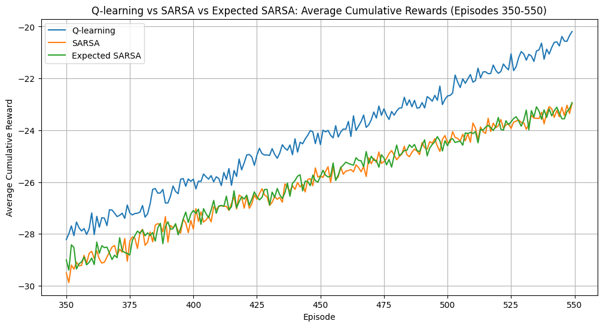

---

# Windy Gridworld Simulation 🌍💨

## Overview 📖

Welcome to the Windy Gridworld Simulation project! This repository showcases an implementation of a classic reinforcement learning problem, where an agent navigates through a grid world with the added challenge of wind affecting certain columns. The primary focus is on utilizing Q-learning, SARSA, and Expected SARSA algorithms to determine the optimal policy for the agent, allowing it to find the most efficient path to the goal.

## Components of the Repository 🗂️

- `windy_gridworld.py`: Defines the Windy Gridworld environment, including states, actions, rewards, and wind effects.
- `algorithms.py`: Implements Q-learning, SARSA, and Expected SARSA algorithms with multiple trials for averaging.
- `visualizations.py`: Contains functions to visualize the running average of cumulative rewards and zoomed comparisons.
- `main.py`: The executable script that ties all components together, running the simulation and generating insightful visualizations.

## Environment Details 🌐

### States 📍

Each position in a 10x7 grid is represented as a state (x, y), where:
- `x` ranges from 0 to 9
- `y` ranges from 0 to 6

### Actions 🔀

The agent can move in four directions:
- 'Up' 🡑
- 'Down' 🡓
- 'Left' 🡐
- 'Right' 🡒

### Wind Strength 💨

Certain columns have wind that pushes the agent up by a fixed number of rows regardless of the agent's chosen action:
- Columns 3, 4, 5 have wind strength 1.
- Columns 6, 7 have wind strength 2.
- Column 8 has wind strength 1.

### Rewards 🎁

- **Terminal State Reward**: The agent receives a reward of 0 upon reaching the terminal state located at (7, 3).
- **Step Penalty**: To encourage efficiency, a penalty of -1 is applied for each movement.

## Algorithms Implemented 🔄

1. **Q-learning**
2. **SARSA**
3. **Expected SARSA**

## Setup & Installation 🛠️

Ensure Python is installed on your system, along with the following packages:
- `numpy`
- `matplotlib`

You can install these using pip:

```bash
pip install numpy matplotlib
```

## Running the Simulation 🚀

To execute the simulation and see the algorithms in action, run:

```bash
python main.py
```

## Visualizations 📊

### Running Average of Cumulative Rewards

The visualization shows the running average of cumulative rewards for Q-learning, SARSA, and Expected SARSA algorithms over episodes. This helps in understanding the learning stability and progress of each algorithm.


### Zoomed Comparison of Average Cumulative Rewards

This plot focuses on a specific range of episodes to highlight where Q-learning shows superiority over SARSA and Expected SARSA, providing a clearer picture of the performance differences.



## Inferences from Visualizations 🧐

- **Running Average of Cumulative Rewards**:

  - **Q-learning**: Demonstrates a stable learning process, consistently improving and achieving higher rewards compared to SARSA and Expected SARSA.
  - **SARSA**: Shows a steady learning curve but generally performs slightly worse than Q-learning.
  - **Expected SARSA**: Performs similarly to SARSA but with slightly better stability due to the averaging effect of expected values.

- **Zoomed Comparison of Average Cumulative Rewards**:

  - **Q-learning**: Shows clear superiority in certain ranges of episodes, indicating faster convergence and better policy optimization.
  - **SARSA and Expected SARSA**: Both algorithms show competitive performance but tend to converge slower compared to Q-learning.
 
## Contributing 🤝

Feel free to fork this project. Enjoy exploring reinforcement learning with this 10-arm testbed simulation! 🌟

## License 📄

This project is open-source and available under the MIT License.

---
